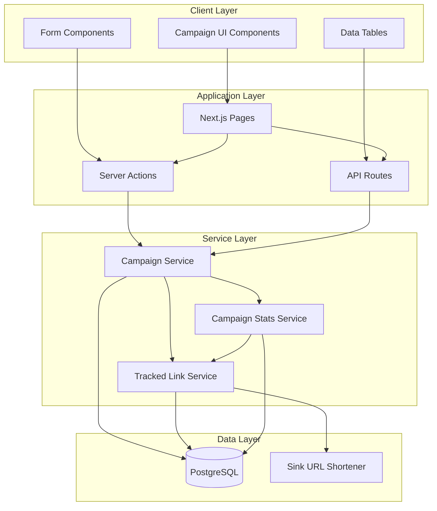

# Design Document: Campaigns MVP Interface

## Overview

The Campaigns MVP Interface provides a comprehensive web-based UI for managing marketing campaigns in ReachDem. This feature enables users to create, edit, launch, schedule, and monitor SMS and Email campaigns through an intuitive interface integrated with the existing ReachDem dashboard.

### Key Capabilities

- Campaign lifecycle management (create, edit, delete, launch, schedule)
- Multi-channel support (SMS and Email) with channel-specific composers
- Audience targeting via groups and segments
- Real-time campaign statistics and message tracking
- Responsive design for desktop, tablet, and mobile devices
- Consistent UI/UX with existing ReachDem dashboard

### Technical Context

The interface is built using:

- **Framework**: Next.js 16 (App Router) with React 19
- **Language**: TypeScript
- **Styling**: Tailwind CSS with shadcn/ui components
- **Forms**: React Hook Form with Zod validation
- **State Management**: Zustand for client state
- **API Integration**: Server Actions and REST API endpoints
- **Authentication**: Better Auth with workspace-based authorization

The implementation leverages existing ReachDem infrastructure including:

- Campaign Service API (`@reachdem/core`)
- Tracked Link Service for URL shortening
- Database models via Prisma (`@reachdem/database`)
- Shared validation schemas (`@reachdem/shared`)

## Architecture

### High-Level Architecture



### Routing Structure

The feature follows Next.js App Router conventions with authenticated routes:

```
/campaigns                          # Campaign listing page
/campaigns/new                      # Campaign creation flow
/campaigns/[id]                     # Campaign details page
/campaigns/[id]/edit                # Campaign editing page
```

### Data Flow Patterns

1. **Campaign Creation Flow**:
   - User fills form → Client validation → Server Action → Campaign Service → Database
   - Audience selection → Separate API call to set audiences
   - URL detection in SMS → Tracked Link Service → Sink API

2. **Campaign Launch Flow**:
   - User clicks launch → Validation → Campaign Service → Status update → Queue job
   - Background worker processes messages → Creates message targets

3. **Statistics Flow**:
   - Campaign details page → API call → Campaign Stats Service
   - Stats service aggregates from message targets and tracked links
   - Cached results with invalidation on updates

## Components and Interfaces

### Page Components

#### CampaignListingPage (`/campaigns/page.tsx`)

- Displays paginated table of campaigns
- Provides search and filtering
- Shows campaign status, channel, and metadata
- Actions: Create, Edit (draft only), View details

#### CampaignCreationPage (`/campaigns/new/page.tsx`)

- Multi-section form for campaign creation
- Dynamic composer based on channel selection
- Audience selection interface
- Actions: Save draft, Launch now, Schedule

#### CampaignDetailsPage (`/campaigns/[id]/page.tsx`)

- Campaign header with key information
- Statistics cards (audience size, sent, failed, clicks)
- Message targets table with pagination
- Actions: Edit (if draft), Delete (if draft)

#### CampaignEditPage (`/campaigns/[id]/edit/page.tsx`)

- Pre-filled form with existing campaign data
- Same interface as creation page
- Restricted editing based on campaign status

### Form Components

#### CampaignForm

Main form component handling campaign creation and editing.

**Props**:

```typescript
interface CampaignFormProps {
  initialData?: Campaign | null;
  groups: { id: string; name: string }[];
  segments: { id: string; name: string }[];
  mode: "create" | "edit";
}
```

**Sections**:

1. General Details (name, description)
2. Channel & Content (channel selector, composer)
3. Target Audience (groups, segments)
4. Actions (save, launch, schedule, delete)

**State Management**:

- Form state via React Hook Form
- Unsaved changes tracking for navigation warnings
- Loading states for async operations

#### AudienceSelector

Component for selecting groups and segments.

**Props**:

```typescript
interface AudienceSelectorProps {
  groups: { id: string; name: string }[];
  segments: { id: string; name: string }[];
  selectedGroups: string[];
  selectedSegments: string[];
  onGroupsChange: (ids: string[]) => void;
  onSegmentsChange: (ids: string[]) => void;
  disabled?: boolean;
}
```

**Features**:

- Checkbox-based multi-select
- Visual grouping of groups vs segments
- Empty state handling
- Loading states

### Composer Components

#### SMSComposer

Specialized component for SMS message composition.

**Props**:

```typescript
interface SMSComposerProps {
  value: string;
  onChange: (value: string) => void;
  disabled?: boolean;
}
```

**Features**:

- Text input with character counter
- 160 character limit enforcement
- Automatic URL detection and shortening
- Variable insertion UI
- Warning display for length violations

**URL Shortening Logic**:

```typescript
// Detect URLs in message text
const urlRegex = /(https?:\/\/[^\s]+)/g;
const urls = message.match(urlRegex);

// For each URL, call Tracked Link Service
for (const url of urls) {
  const shortened = await createTrackedLink({
    targetUrl: url,
    campaignId: campaign.id,
    channel: "sms",
  });
  // Replace original URL with shortened version
  message = message.replace(url, shortened.shortUrl);
}
```

#### EmailComposer

Rich email composition component with multiple editing modes.

**Props**:

```typescript
interface EmailComposerProps {
  value: EmailContent;
  onChange: (value: EmailContent) => void;
  disabled?: boolean;
}

interface EmailContent {
  subject: string;
  body: string;
  mode: "rich" | "html" | "react-email";
}
```

**Features**:

- Mode selector (Rich text, HTML, React Email)
- TipTap editor for rich text mode
- Code editor for HTML mode
- React Email template editor
- Preview functionality
- Content preservation across mode switches

**Mode Switching Logic**:
The composer maintains an internal representation and converts between formats:

- Rich text → HTML: TipTap's built-in serialization
- HTML → Rich text: TipTap's HTML parser
- React Email → HTML: Server-side rendering
- HTML → React Email: Template wrapping

### Table Components

#### CampaignsTable

Data table for campaign listing.

**Columns**:

- Name (with link to details)
- Channel (badge)
- Status (badge with color coding)
- Updated at (formatted date)
- Actions (dropdown menu)

**Features**:

- Client-side search filtering
- Pagination (50 items per page)
- Sorting by columns
- Row actions (Edit, View, Delete)
- Loading skeleton states

#### MessageTargetsTable

Data table for campaign message targets.

**Columns**:

- Contact/Destination (email or phone)
- Status (badge)
- Message ID (truncated with copy)
- Sent at (formatted date)

**Features**:

- Server-side pagination
- Search by contact/destination
- Status filtering
- Export functionality (future)

### UI Components

Leveraging existing shadcn/ui components:

- `Button`, `Input`, `Textarea`, `Label`
- `Select`, `Checkbox`, `RadioGroup`
- `Card`, `Table`, `Badge`, `Separator`
- `Dialog`, `AlertDialog`, `Sheet`
- `Toast` (via Sonner)
- `Skeleton` for loading states

## Data Models

### Campaign Model

```typescript
interface Campaign {
  id: string;
  organizationId: string;
  name: string;
  description: string | null;
  channel: "sms" | "email";
  status: "draft" | "running" | "partial" | "completed" | "failed";
  content: SmsCampaignContent | EmailCampaignContent;
  scheduledAt: Date | null;
  createdBy: string | null;
  createdAt: Date;
  updatedAt: Date;
}

interface SmsCampaignContent {
  text: string; // Max 160 chars (allows for 10 SMS segments)
  from?: string; // Sender ID
}

interface EmailCampaignContent {
  subject: string; // Max 200 chars
  html: string; // Max 200KB
  from?: string; // Sender email
}
```

### Campaign Audience Model

```typescript
interface CampaignAudience {
  id: string;
  campaignId: string;
  sourceType: "group" | "segment";
  sourceId: string;
  createdAt: Date;
}
```

### Message Target Model

```typescript
interface MessageTarget {
  id: string;
  campaignId: string;
  contactId: string | null;
  destination: string; // Email or phone number
  status: "pending" | "sent" | "failed" | "skipped";
  messageId: string | null;
  errorMessage: string | null;
  sentAt: Date | null;
  createdAt: Date;
  updatedAt: Date;
}
```

### Campaign Stats Model

```typescript
interface CampaignStats {
  campaignId: string;
  audienceSize: number; // Total targets
  sentCount: number; // Successfully sent
  failedCount: number; // Failed to send
  clickCount: number; // Total clicks on tracked links
  uniqueClickCount: number; // Unique contacts who clicked
}
```

### Tracked Link Model

```typescript
interface TrackedLink {
  id: string;
  organizationId: string;
  sinkLinkId: string;
  slug: string;
  shortUrl: string; // Public shortened URL
  targetUrl: string; // Original URL
  campaignId: string | null;
  messageId: string | null;
  contactId: string | null;
  channel: "sms" | "email" | null;
  status: "active" | "inactive";
  totalClicks: number | null;
  uniqueClicks: number | null;
  lastStatsSyncAt: Date | null;
  createdAt: Date;
  updatedAt: Date;
}
```

### API Request/Response Types

#### Create Campaign Request

```typescript
interface CreateCampaignRequest {
  name: string;
  description?: string;
  channel: "sms" | "email";
  content: SmsCampaignContent | EmailCampaignContent;
  scheduledAt?: Date;
}
```

#### Update Campaign Request

```typescript
interface UpdateCampaignRequest {
  name?: string;
  description?: string | null;
  channel?: "sms" | "email";
  content?: SmsCampaignContent | EmailCampaignContent;
  scheduledAt?: Date | null;
}
```

#### Set Audience Request

```typescript
interface SetAudienceRequest {
  audiences: Array<{
    sourceType: "group" | "segment";
    sourceId: string;
  }>;
}
```

#### Launch Campaign Request

```typescript
interface LaunchCampaignRequest {
  // Empty body - uses campaign's existing configuration
}
```

#### Schedule Campaign Request

```typescript
interface ScheduleCampaignRequest {
  scheduledAt: Date; // Must be in the future
}
```

## API Integration

### Existing API Endpoints

The interface integrates with existing Campaign API endpoints:

#### Campaign CRUD

- `GET /api/v1/campaigns` - List campaigns (with pagination)
- `POST /api/v1/campaigns` - Create campaign
- `GET /api/v1/campaigns/:id` - Get campaign details
- `PATCH /api/v1/campaigns/:id` - Update campaign
- `DELETE /api/v1/campaigns/:id` - Delete campaign

#### Campaign Actions

- `POST /api/v1/campaigns/:id/audience` - Set campaign audience
- `POST /api/v1/campaigns/:id/launch` - Launch campaign immediately
- `POST /api/v1/campaigns/:id/schedule` - Schedule campaign for future

#### Campaign Statistics

- `GET /api/v1/campaigns/:id/stats` - Get campaign statistics
- `GET /api/v1/campaigns/:id/targets` - List message targets (paginated)

#### Tracked Links

- `POST /api/v1/links` - Create tracked link (for URL shortening)
- `GET /api/v1/links` - List tracked links
- `GET /api/v1/links/:id` - Get link details
- `GET /api/v1/links/:id/stats` - Get link statistics

### Server Actions

Server Actions provide a simplified interface for common operations:

```typescript
// actions/campaigns.ts

export async function createCampaign(
  data: CreateCampaignRequest
): Promise<Campaign>;
export async function updateCampaign(
  id: string,
  data: UpdateCampaignRequest
): Promise<Campaign>;
export async function deleteCampaign(id: string): Promise<void>;
export async function launchCampaign(id: string): Promise<Campaign>;
export async function scheduleCampaign(
  id: string,
  scheduledAt: Date
): Promise<Campaign>;
export async function setAudience(
  id: string,
  audiences: AudienceInput[]
): Promise<void>;
```

### Error Handling

API errors are handled consistently:

```typescript
try {
  const campaign = await createCampaign(data);
  toast.success("Campaign created successfully");
  router.push(`/campaigns/${campaign.id}`);
} catch (error) {
  if (error instanceof ValidationError) {
    // Display field-specific errors
    setError("name", { message: error.message });
  } else if (error instanceof AuthorizationError) {
    toast.error("You do not have permission to perform this action");
  } else {
    toast.error(error.message || "An unexpected error occurred");
  }
}
```

### Loading States

All API calls display appropriate loading indicators:

- Button spinners during form submission
- Skeleton loaders for data fetching
- Disabled states to prevent duplicate submissions
- Minimum display time (300ms) to avoid flicker

## Implementation Approach

### Phase 1: Core Infrastructure

1. Set up routing structure
2. Create base page components
3. Implement campaign listing with existing API
4. Add basic navigation and layout

### Phase 2: Campaign Creation

1. Build CampaignForm component
2. Implement AudienceSelector
3. Create basic SMS and Email composers
4. Add form validation and submission
5. Integrate with campaign creation API

### Phase 3: Content Composers

1. Implement SMSComposer with character counting
2. Add URL detection and shortening for SMS
3. Build EmailComposer with TipTap integration
4. Implement mode switching (Rich/HTML/React Email)
5. Add preview functionality

### Phase 4: Campaign Management

1. Implement campaign editing
2. Add launch and schedule functionality
3. Build campaign deletion with confirmation
4. Add unsaved changes warning

### Phase 5: Campaign Details & Stats

1. Create campaign details page layout
2. Implement statistics cards
3. Build message targets table
4. Add real-time stats refresh
5. Implement search and filtering

### Phase 6: Polish & Optimization

1. Add responsive design breakpoints
2. Implement loading skeletons
3. Add empty states
4. Optimize performance (memoization, lazy loading)
5. Add accessibility improvements
6. Comprehensive error handling

### Development Guidelines

**Component Organization**:

- Page components in `app/(authenticated)/campaigns/`
- Shared components in `components/campaigns/`
- UI primitives in `components/ui/`
- Server actions in `app/actions/campaigns.ts`

**Naming Conventions**:

- Components: PascalCase (e.g., `CampaignForm`)
- Files: kebab-case (e.g., `campaign-form.tsx`)
- Server actions: camelCase (e.g., `createCampaign`)
- API routes: REST conventions

**State Management**:

- Form state: React Hook Form
- Server state: React Query (via Server Actions)
- UI state: Local component state or Zustand
- URL state: Next.js searchParams

**Styling**:

- Tailwind utility classes
- Component variants via CVA (class-variance-authority)
- Consistent spacing scale (4px base)
- Design tokens from existing dashboard

**Testing Strategy** (covered in detail below)

## Correctness Properties

_A property is a characteristic or behavior that should hold true across all valid executions of a system—essentially, a formal statement about what the system should do. Properties serve as the bridge between human-readable specifications and machine-verifiable correctness guarantees._

### Property 1: Workspace Data Isolation

_For any_ workspace and any campaign listing request, all returned campaigns should belong only to the requesting workspace and no campaigns from other workspaces should be included.

**Validates: Requirements 1.6, 3.2, 3.3, 11.2**

### Property 2: Campaign Search Filtering

_For any_ search term and campaign list, the filtered results should only include campaigns whose names contain the search term (case-insensitive).

**Validates: Requirements 1.7**

### Property 3: Pagination Consistency

_For any_ paginated list of campaigns, the union of all pages should equal the complete dataset, with no duplicates and no missing items.

**Validates: Requirements 1.8, 11.12**

### Property 4: Required Field Validation

_For any_ campaign form submission with missing required fields (name or channel), the submission should be prevented and validation errors should be displayed for each missing field.

**Validates: Requirements 2.3, 2.5, 2.6, 2.7**

### Property 5: Audience Multi-Selection

_For any_ set of groups and segments, selecting and deselecting items should correctly update the selected audiences list, and the UI should reflect the current selection state.

**Validates: Requirements 3.4, 3.5, 3.6, 3.7**

### Property 6: SMS Character Count Accuracy

_For any_ SMS message text, the displayed character count should exactly match the actual length of the message string.

**Validates: Requirements 4.4**

### Property 7: SMS Length Validation

_For any_ SMS message exceeding 160 characters, the composer should display a warning and prevent form submission.

**Validates: Requirements 4.5, 4.6**

### Property 8: URL Detection and Shortening

_For any_ SMS message containing URLs, all detected URLs should be automatically shortened using the tracked link service and replaced in the message with their shortened versions.

**Validates: Requirements 4.7, 4.8, 4.9**

### Property 9: Tracked Link Campaign Association

_For any_ URL shortened within a campaign SMS message, the created tracked link should be associated with the campaign ID to enable click tracking.

**Validates: Requirements 4.10**

### Property 10: Email Content Mode Preservation

_For any_ valid email content, switching from mode A to mode B and back to mode A should preserve the content equivalently (round-trip property).

**Validates: Requirements 5.7, 6.8**

### Property 11: Email Content Format Submission

_For any_ email composer mode (Rich text, HTML, React Email), the submitted content should be in the format appropriate for that mode.

**Validates: Requirements 5.8**

### Property 12: Email Content Parsing

_For any_ valid email content in Rich text, HTML, or React Email format, parsing should successfully convert it to an internal representation without errors.

**Validates: Requirements 6.1, 6.2, 6.3**

### Property 13: Email Content Formatting

_For any_ valid internal email representation, formatting should successfully convert it to Rich text, HTML, or React Email format without errors.

**Validates: Requirements 6.5, 6.6, 6.7**

### Property 14: Launch Validation

_For any_ campaign launch attempt, all required fields should be validated before the launch API is called.

**Validates: Requirements 7.2**

### Property 15: Schedule Future Date Validation

_For any_ campaign scheduling attempt, the selected datetime must be validated to be in the future, and past dates should be rejected with an error.

**Validates: Requirements 8.5, 8.6**

### Property 16: Draft-Only Edit Actions

_For any_ campaign with status "draft", edit actions should be available; for any campaign with status other than "draft", edit actions should be hidden or disabled.

**Validates: Requirements 9.1, 9.9**

### Property 17: Draft-Only Delete Actions

_For any_ campaign with status "draft", delete actions should be available; for any campaign with status other than "draft", delete actions should be hidden or disabled.

**Validates: Requirements 10.1**

### Property 18: Form Pre-fill Accuracy

_For any_ existing campaign being edited, all form fields should be pre-filled with the exact values from the loaded campaign data.

**Validates: Requirements 9.4**

### Property 19: Read-Only Non-Draft Display

_For any_ campaign with status other than "draft", the edit page should display a read-only view and prevent any modifications.

**Validates: Requirements 9.10**

### Property 20: Message Targets Search

_For any_ search term in the message targets table, the filtered results should only include targets whose contact/destination contains the search term.

**Validates: Requirements 11.11**

### Property 21: Unsaved Changes Tracking

_For any_ modification to any field in the campaign form, the unsaved changes state should be set to true; after successful save, it should be set to false.

**Validates: Requirements 12.1, 12.4**

### Property 22: Navigation Blocking with Unsaved Changes

_For any_ navigation attempt when unsaved changes exist, a confirmation dialog should be displayed and navigation should only proceed after explicit user confirmation.

**Validates: Requirements 12.2**

### Property 23: Touch Target Minimum Size

_For any_ interactive element (button, link, checkbox) on mobile viewports, the touch target size should be at least 44x44 pixels.

**Validates: Requirements 13.6**

### Property 24: Loading Indicator Display

_For any_ API request in progress, an appropriate loading indicator (spinner or skeleton) should be visible until the request completes.

**Validates: Requirements 15.1, 15.2, 15.3**

### Property 25: Interactive Element Disabling During Processing

_For any_ form submission or action button click that triggers an API request, the interactive elements should be disabled until the request completes to prevent duplicate submissions.

**Validates: Requirements 15.4**

## Error Handling

### Error Categories

The interface handles four main categories of errors:

1. **Validation Errors**: Client-side and server-side validation failures
2. **Authorization Errors**: Insufficient permissions or workspace access issues
3. **Network Errors**: API communication failures, timeouts
4. **Business Logic Errors**: Campaign state violations, resource conflicts

### Error Display Patterns

**Form Validation Errors**:

- Inline field errors below input fields
- Red border on invalid fields
- Error summary at form level for multiple errors
- Prevent submission until errors are resolved

**API Errors**:

- Toast notifications for transient errors
- Error state components for critical failures
- Retry buttons where appropriate
- Detailed error messages in development mode

**Network Errors**:

- Automatic retry with exponential backoff (3 attempts)
- Offline detection and user notification
- Graceful degradation for non-critical features
- Clear messaging about connectivity issues

### Error Recovery

**Recoverable Errors**:

- Form validation: User corrects input and resubmits
- Network timeout: Automatic retry or manual retry button
- Optimistic updates: Rollback on failure with notification

**Non-Recoverable Errors**:

- Authorization failures: Redirect to login or show access denied
- Resource not found: Redirect to listing page with notification
- Server errors: Display error page with support contact

### Error Logging

All errors are logged with context:

```typescript
logger.error("Campaign creation failed", {
  userId,
  organizationId,
  error: error.message,
  stack: error.stack,
  formData: sanitizedFormData,
});
```

Sensitive data (passwords, tokens) is sanitized before logging.

## Testing Strategy

### Dual Testing Approach

The Campaigns MVP Interface requires both unit testing and property-based testing for comprehensive coverage:

- **Unit tests**: Verify specific examples, edge cases, and error conditions
- **Property tests**: Verify universal properties across all inputs

Both approaches are complementary and necessary. Unit tests catch concrete bugs in specific scenarios, while property tests verify general correctness across a wide range of inputs.

### Unit Testing

**Focus Areas**:

- Specific UI interactions (button clicks, form submissions)
- Component rendering with specific props
- Edge cases (empty states, error states, loading states)
- Integration points between components
- API mocking and error scenarios

**Testing Library Stack**:

- **Framework**: Vitest
- **React Testing**: React Testing Library
- **User Interactions**: @testing-library/user-event
- **API Mocking**: MSW (Mock Service Worker)

**Example Unit Tests**:

```typescript
describe('CampaignForm', () => {
  it('displays validation error when name is empty', async () => {
    render(<CampaignForm mode="create" groups={[]} segments={[]} />);
    const submitButton = screen.getByRole('button', { name: /create/i });
    await userEvent.click(submitButton);
    expect(screen.getByText(/campaign name is required/i)).toBeInTheDocument();
  });

  it('shows SMS composer when SMS channel is selected', async () => {
    render(<CampaignForm mode="create" groups={[]} segments={[]} />);
    const channelSelect = screen.getByLabelText(/channel/i);
    await userEvent.selectOptions(channelSelect, 'sms');
    expect(screen.getByTestId('sms-composer')).toBeInTheDocument();
  });
});
```

### Property-Based Testing

**Focus Areas**:

- Universal properties that hold for all inputs
- Data transformation round-trips (parsing/formatting)
- Validation rules across input ranges
- State management consistency
- Workspace isolation guarantees

**Testing Library**:

- **Framework**: fast-check (JavaScript property-based testing library)
- **Configuration**: Minimum 100 iterations per property test

**Property Test Structure**:
Each property test must:

1. Reference its design document property number
2. Use the tag format: `Feature: campaigns-mvp-interface, Property {number}: {property_text}`
3. Generate random inputs using fast-check arbitraries
4. Assert the property holds for all generated inputs

**Example Property Tests**:

```typescript
import fc from "fast-check";

describe("Property Tests: Campaigns MVP Interface", () => {
  // Feature: campaigns-mvp-interface, Property 1: Workspace Data Isolation
  it("Property 1: only returns campaigns from requesting workspace", async () => {
    await fc.assert(
      fc.asyncProperty(
        fc.array(campaignArbitrary, { minLength: 1, maxLength: 50 }),
        fc.uuid(),
        async (campaigns, requestingWorkspaceId) => {
          // Setup: Create campaigns in different workspaces
          await setupCampaigns(campaigns);

          // Act: Request campaigns for specific workspace
          const result = await listCampaigns(requestingWorkspaceId);

          // Assert: All returned campaigns belong to requesting workspace
          expect(
            result.every((c) => c.organizationId === requestingWorkspaceId)
          ).toBe(true);
        }
      ),
      { numRuns: 100 }
    );
  });

  // Feature: campaigns-mvp-interface, Property 6: SMS Character Count Accuracy
  it("Property 6: character count matches actual message length", () => {
    fc.assert(
      fc.property(
        fc.string({ minLength: 0, maxLength: 500 }),
        (messageText) => {
          const count = calculateCharacterCount(messageText);
          expect(count).toBe(messageText.length);
        }
      ),
      { numRuns: 100 }
    );
  });

  // Feature: campaigns-mvp-interface, Property 10: Email Content Mode Preservation
  it("Property 10: round-trip mode switching preserves content", async () => {
    await fc.assert(
      fc.asyncProperty(
        emailContentArbitrary,
        fc.constantFrom("rich", "html", "react-email"),
        async (content, modeA) => {
          const modeB = modeA === "rich" ? "html" : "rich";

          // Convert A -> B -> A
          const convertedToB = await convertEmailContent(content, modeA, modeB);
          const convertedBackToA = await convertEmailContent(
            convertedToB,
            modeB,
            modeA
          );

          // Assert: Content is equivalent after round-trip
          expect(normalizeEmailContent(convertedBackToA)).toEqual(
            normalizeEmailContent(content)
          );
        }
      ),
      { numRuns: 100 }
    );
  });

  // Feature: campaigns-mvp-interface, Property 21: Unsaved Changes Tracking
  it("Property 21: form modifications set unsaved state", () => {
    fc.assert(
      fc.property(
        fc.record({
          name: fc.string(),
          description: fc.option(fc.string()),
          channel: fc.constantFrom("sms", "email"),
        }),
        (formData) => {
          const form = createCampaignForm();

          // Modify any field
          form.setValue("name", formData.name);

          // Assert: Unsaved changes state is true
          expect(form.hasUnsavedChanges()).toBe(true);
        }
      ),
      { numRuns: 100 }
    );
  });
});
```

**Custom Arbitraries**:

```typescript
// Generate random campaign data
const campaignArbitrary = fc.record({
  id: fc.uuid(),
  organizationId: fc.uuid(),
  name: fc.string({ minLength: 1, maxLength: 100 }),
  description: fc.option(fc.string({ maxLength: 500 })),
  channel: fc.constantFrom("sms", "email"),
  status: fc.constantFrom("draft", "running", "completed", "failed"),
  content: fc.oneof(
    fc.record({ text: fc.string({ maxLength: 160 }) }), // SMS
    fc.record({ subject: fc.string(), html: fc.string() }) // Email
  ),
  createdAt: fc.date(),
  updatedAt: fc.date(),
});

// Generate random email content
const emailContentArbitrary = fc.record({
  subject: fc.string({ minLength: 1, maxLength: 200 }),
  body: fc.string({ minLength: 1, maxLength: 10000 }),
});

// Generate random workspace ID
const workspaceIdArbitrary = fc.uuid();
```

### Integration Testing

**Scope**:

- End-to-end user flows (create campaign → launch → view stats)
- API integration with real backend services
- Database state verification
- Multi-component interactions

**Tools**:

- Playwright for E2E tests
- Test database with seed data
- API mocking for external services (Sink URL shortener)

**Key Integration Tests**:

1. Complete campaign creation flow
2. Campaign editing and launching
3. Statistics aggregation and display
4. URL shortening in SMS campaigns
5. Workspace isolation across operations

### Test Coverage Goals

- **Unit Tests**: 80% code coverage minimum
- **Property Tests**: All 25 correctness properties implemented
- **Integration Tests**: All critical user flows covered
- **E2E Tests**: Happy path and major error scenarios

### Testing Best Practices

1. **Avoid Over-Testing**: Don't write excessive unit tests for scenarios covered by property tests
2. **Focus Unit Tests**: Use unit tests for specific examples, edge cases, and integration points
3. **Property Test Configuration**: Always run minimum 100 iterations to ensure statistical confidence
4. **Test Isolation**: Each test should be independent and not rely on other tests
5. **Realistic Data**: Use realistic test data that matches production patterns
6. **Error Scenarios**: Test both success and failure paths
7. **Accessibility**: Include accessibility tests (ARIA labels, keyboard navigation)

### Continuous Integration

All tests run automatically on:

- Pull request creation
- Commits to main branch
- Pre-deployment checks

CI pipeline stages:

1. Linting and type checking
2. Unit tests (parallel execution)
3. Property tests (parallel execution)
4. Integration tests (sequential)
5. E2E tests (critical paths only)

Test failures block deployment to production.
