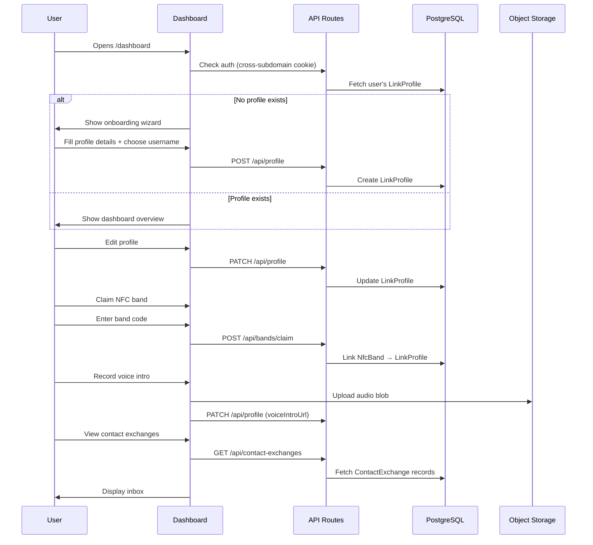

# Link by ReachDem — Dashboard & Profile Management

## Overview

The dashboard at `link.reachdem.cc/dashboard` is a lightweight, mobile-friendly management interface where users create and edit their Link profile, manage NFC bands, view contact exchanges, and check analytics. It uses the same auth session as the main ReachDem platform via cross-subdomain cookies.

## Dashboard Flow



## Wireframes

### Dashboard — Overview

```wireframe

<html>
<head>
<style>
  * { margin: 0; padding: 0; box-sizing: border-box; }
  body { font-family: -apple-system, BlinkMacSystemFont, 'Segoe UI', sans-serif; background: #f5f5f7; }
  .app { max-width: 430px; margin: 0 auto; min-height: 100vh; background: #fff; }
  .header { padding: 16px 20px; display: flex; align-items: center; justify-content: space-between; border-bottom: 1px solid #f0f0f0; }
  .header-title { font-size: 18px; font-weight: 700; color: #1a1a2e; }
  .header-avatar { width: 32px; height: 32px; border-radius: 50%; background: #e0e0e0; display: flex; align-items: center; justify-content: center; font-size: 14px; }
  .stats-row { display: grid; grid-template-columns: 1fr 1fr 1fr; gap: 12px; padding: 20px; }
  .stat-card { background: #f8f9fa; border-radius: 12px; padding: 16px; text-align: center; }
  .stat-value { font-size: 24px; font-weight: 700; color: #1a1a2e; }
  .stat-label { font-size: 11px; color: #888; margin-top: 4px; }
  .section { padding: 0 20px 20px; }
  .section-header { display: flex; justify-content: space-between; align-items: center; margin-bottom: 12px; }
  .section-title { font-size: 15px; font-weight: 600; color: #1a1a2e; }
  .section-link { font-size: 12px; color: #666; }
  .profile-preview { border: 1px solid #e8e8e8; border-radius: 16px; padding: 16px; display: flex; align-items: center; gap: 14px; }
  .preview-avatar { width: 56px; height: 56px; border-radius: 50%; background: #e0e0e0; display: flex; align-items: center; justify-content: center; font-size: 24px; }
  .preview-info { flex: 1; }
  .preview-name { font-size: 15px; font-weight: 600; color: #1a1a2e; }
  .preview-url { font-size: 12px; color: #888; margin-top: 2px; }
  .preview-status { display: inline-block; padding: 2px 8px; border-radius: 10px; font-size: 10px; font-weight: 600; margin-top: 6px; }
  .preview-status.live { background: #DCFCE7; color: #16A34A; }
  .preview-btn { padding: 8px 14px; border-radius: 8px; background: #f0f0f5; border: none; font-size: 12px; color: #1a1a2e; font-weight: 500; cursor: pointer; }
  .quick-actions { display: grid; grid-template-columns: 1fr 1fr; gap: 10px; }
  .action-card { border: 1px solid #e8e8e8; border-radius: 12px; padding: 14px; cursor: pointer; }
  .action-icon { font-size: 20px; margin-bottom: 8px; }
  .action-label { font-size: 13px; font-weight: 500; color: #333; }
  .action-desc { font-size: 11px; color: #999; margin-top: 2px; }
  .recent-contacts { }
  .contact-item { display: flex; align-items: center; gap: 12px; padding: 12px 0; border-bottom: 1px solid #f5f5f5; }
  .contact-avatar { width: 36px; height: 36px; border-radius: 50%; background: #f0f0f5; display: flex; align-items: center; justify-content: center; font-size: 14px; }
  .contact-info { flex: 1; }
  .contact-name { font-size: 13px; font-weight: 500; color: #333; }
  .contact-time { font-size: 11px; color: #999; }
  .contact-badge { width: 8px; height: 8px; border-radius: 50%; background: #3B82F6; }
  .bottom-nav { position: fixed; bottom: 0; left: 50%; transform: translateX(-50%); width: 100%; max-width: 430px; background: #fff; border-top: 1px solid #f0f0f0; display: flex; padding: 8px 0 24px; }
  .nav-item { flex: 1; display: flex; flex-direction: column; align-items: center; gap: 4px; padding: 8px 0; cursor: pointer; }
  .nav-icon { font-size: 18px; }
  .nav-label { font-size: 10px; color: #888; }
  .nav-item.active .nav-label { color: #1a1a2e; font-weight: 600; }
</style>
</head>
<body>
  <div class="app">
    <div class="header">
      <div class="header-title">Link Dashboard</div>
      <div class="header-avatar" data-element-id="user-menu">JP</div>
    </div>

    <div class="stats-row">
      <div class="stat-card">
        <div class="stat-value">247</div>
        <div class="stat-label">Scans</div>
      </div>
      <div class="stat-card">
        <div class="stat-value">89</div>
        <div class="stat-label">Contacts</div>
      </div>
      <div class="stat-card">
        <div class="stat-value">1.2k</div>
        <div class="stat-label">Link clicks</div>
      </div>
    </div>

    <div class="section">
      <div class="section-header">
        <div class="section-title">Mon profil</div>
      </div>
      <div class="profile-preview">
        <div class="preview-avatar">👤</div>
        <div class="preview-info">
          <div class="preview-name">Jean-Pierre Kamga</div>
          <div class="preview-url">link.reachdem.cc/jpkamga</div>
          <span class="preview-status live">● En ligne</span>
        </div>
        <button class="preview-btn" data-element-id="edit-profile">Modifier</button>
      </div>
    </div>

    <div class="section">
      <div class="section-header">
        <div class="section-title">Actions rapides</div>
      </div>
      <div class="quick-actions">
        <div class="action-card" data-element-id="manage-links">
          <div class="action-icon">🔗</div>
          <div class="action-label">Réseaux sociaux</div>
          <div class="action-desc">6 liens actifs</div>
        </div>
        <div class="action-card" data-element-id="manage-payments">
          <div class="action-icon">💰</div>
          <div class="action-label">Paiements</div>
          <div class="action-desc">4 méthodes</div>
        </div>
        <div class="action-card" data-element-id="manage-bands">
          <div class="action-icon">📱</div>
          <div class="action-label">Bracelets NFC</div>
          <div class="action-desc">1 actif</div>
        </div>
        <div class="action-card" data-element-id="manage-sos">
          <div class="action-icon">🚨</div>
          <div class="action-label">SOS / Urgence</div>
          <div class="action-desc">Configuré</div>
        </div>
      </div>
    </div>

    <div class="section">
      <div class="section-header">
        <div class="section-title">Contacts récents</div>
        <span class="section-link" data-element-id="view-all-contacts">Voir tout →</span>
      </div>
      <div class="recent-contacts">
        <div class="contact-item">
          <div class="contact-avatar">AM</div>
          <div class="contact-info">
            <div class="contact-name">Aline Mbarga</div>
            <div class="contact-time">Il y a 2 heures</div>
          </div>
          <div class="contact-badge"></div>
        </div>
        <div class="contact-item">
          <div class="contact-avatar">PN</div>
          <div class="contact-info">
            <div class="contact-name">Paul Nkeng</div>
            <div class="contact-time">Hier</div>
          </div>
        </div>
        <div class="contact-item">
          <div class="contact-avatar">SF</div>
          <div class="contact-info">
            <div class="contact-name">Sophie Fotso</div>
            <div class="contact-time">Il y a 3 jours</div>
          </div>
        </div>
      </div>
    </div>

    <div style="height: 80px;"></div>

    <div class="bottom-nav">
      <div class="nav-item active" data-element-id="nav-home">
        <span class="nav-icon">🏠</span>
        <span class="nav-label">Accueil</span>
      </div>
      <div class="nav-item" data-element-id="nav-analytics">
        <span class="nav-icon">📊</span>
        <span class="nav-label">Analytics</span>
      </div>
      <div class="nav-item" data-element-id="nav-contacts">
        <span class="nav-icon">👥</span>
        <span class="nav-label">Contacts</span>
      </div>
      <div class="nav-item" data-element-id="nav-settings">
        <span class="nav-icon">⚙️</span>
        <span class="nav-label">Réglages</span>
      </div>
    </div>
  </div>
</body>
</html>
```

### Voice Introduction — Record / AI Generate

```wireframe

<html>
<head>
<style>
  * { margin: 0; padding: 0; box-sizing: border-box; }
  body { font-family: -apple-system, BlinkMacSystemFont, 'Segoe UI', sans-serif; background: #f5f5f7; }
  .app { max-width: 430px; margin: 0 auto; min-height: 100vh; background: #fff; }
  .header { padding: 16px 20px; display: flex; align-items: center; gap: 12px; border-bottom: 1px solid #f0f0f0; }
  .back-btn { font-size: 18px; cursor: pointer; color: #333; background: none; border: none; }
  .header-title { font-size: 16px; font-weight: 600; color: #1a1a2e; }
  .content { padding: 20px; }
  .tab-row { display: flex; gap: 8px; margin-bottom: 24px; }
  .tab { flex: 1; padding: 10px; border-radius: 10px; text-align: center; font-size: 13px; font-weight: 500; cursor: pointer; border: 1px solid #e0e0e0; color: #666; }
  .tab.active { background: #1a1a2e; color: #fff; border-color: #1a1a2e; }
  .record-area { text-align: center; padding: 40px 0; }
  .record-btn { width: 80px; height: 80px; border-radius: 50%; background: #DC2626; border: none; cursor: pointer; display: flex; align-items: center; justify-content: center; margin: 0 auto; box-shadow: 0 4px 20px rgba(220,38,38,0.3); }
  .record-btn .mic { font-size: 28px; color: #fff; }
  .record-label { font-size: 13px; color: #888; margin-top: 16px; }
  .record-timer { font-size: 24px; font-weight: 700; color: #1a1a2e; margin-top: 8px; }
  .record-hint { font-size: 12px; color: #bbb; margin-top: 8px; }
  .waveform { height: 60px; background: #f8f9fa; border-radius: 10px; margin: 20px 0; display: flex; align-items: center; justify-content: center; font-size: 12px; color: #ccc; }
  .ai-section { }
  .ai-desc { font-size: 13px; color: #666; margin-bottom: 16px; line-height: 1.5; }
  .form-group { margin-bottom: 16px; }
  .form-label { font-size: 12px; font-weight: 600; color: #555; margin-bottom: 6px; display: block; }
  .form-select { width: 100%; padding: 12px 14px; border: 1px solid #e0e0e0; border-radius: 10px; font-size: 14px; background: #fff; }
  .form-textarea { width: 100%; padding: 12px 14px; border: 1px solid #e0e0e0; border-radius: 10px; font-size: 14px; min-height: 80px; resize: none; }
  .generate-btn { width: 100%; padding: 14px; border-radius: 12px; background: linear-gradient(135deg, #6366F1, #8B5CF6); color: #fff; font-size: 14px; font-weight: 600; border: none; cursor: pointer; display: flex; align-items: center; justify-content: center; gap: 8px; }
  .preview-card { background: #f8f9fa; border-radius: 12px; padding: 16px; margin-top: 16px; display: flex; align-items: center; gap: 12px; }
  .play-btn { width: 40px; height: 40px; border-radius: 50%; background: #1a1a2e; border: none; color: #fff; font-size: 16px; cursor: pointer; display: flex; align-items: center; justify-content: center; }
  .preview-info { flex: 1; }
  .preview-name { font-size: 13px; font-weight: 500; color: #333; }
  .preview-duration { font-size: 11px; color: #999; }
  .delete-btn { font-size: 16px; color: #DC2626; cursor: pointer; background: none; border: none; }
</style>
</head>
<body>
  <div class="app">
    <div class="header">
      <button class="back-btn" data-element-id="back">←</button>
      <div class="header-title">Introduction vocale</div>
    </div>

    <div class="content">
      <div class="tab-row">
        <div class="tab active" data-element-id="tab-record">🎙️ Enregistrer</div>
        <div class="tab" data-element-id="tab-ai">✨ Générer par IA</div>
      </div>

      <div class="record-area">
        <button class="record-btn" data-element-id="record-start">
          <span class="mic">🎙️</span>
        </button>
        <div class="record-label">Appuyez pour enregistrer</div>
        <div class="record-timer">0:00 / 0:30</div>
        <div class="record-hint">Maximum 30 secondes</div>
      </div>

      <div class="waveform" data-element-id="waveform">[Waveform visualization]</div>

      <div class="preview-card">
        <button class="play-btn" data-element-id="play-preview">▶</button>
        <div class="preview-info">
          <div class="preview-name">Mon intro · Français</div>
          <div class="preview-duration">0:12</div>
        </div>
        <button class="delete-btn" data-element-id="delete-intro">🗑️</button>
      </div>
    </div>
  </div>
</body>
</html>
```

## NFC Band / Card Claiming Flow

Band claiming is handled via a smart public route at `/claim/{bandCode}` — there is **no separate dashboard page** for band management.

### Flow:

1. User receives a physical NFC band/card with a code printed on it (e.g., `ABC123`)
2. The band's NFC chip is pre-programmed with `link.reachdem.cc/b/{bandCode}`
3. User can also manually visit `link.reachdem.cc/claim/{bandCode}` or scan the band
4. The `/claim/{bandCode}` route checks the band status:

- **Already claimed** → redirect to the linked profile (`/{username}`)
- **Unclaimed + user is logged in** → auto-claim the band, assign it to the user's active profile, set `status: active`, redirect to dashboard with success toast
- **Unclaimed + user is NOT logged in** → redirect to login page with a return URL, then auto-claim on return

5. The URL `link.reachdem.cc/b/{bandCode}` now redirects to `link.reachdem.cc/{username}`
6. Users can view their claimed bands in the **Settings** page and deactivate/reactivate them

## Voice Introduction — AI Generation

- User selects a language (French, English, Francanglais, Pidgin, Ewondo, Duala, Bamiléké, etc.)
- User provides a short text or selects "auto-generate from my profile"
- System calls an AI TTS service to generate a voice clip (max 30 seconds)
- User previews and confirms before saving
- Audio stored in Cloudflare R2 (via shared R2 utilities), URL saved to `LinkProfile.voiceIntroUrl`

## Profile Editing

The profile editor lives at `/dashboard/profile` as a **single page with tabs/sections** (no separate routes for social links, payments, SOS, or bands):

1. **Basic Info** — avatar upload (crop), display name, headline, bio, username, phone, contact email
2. **Social Links** — drag-and-drop reorderable list, add/remove platforms
3. **Payment Methods** — add MoMo/Orange/Max It numbers (with E.164 phone validation), crypto addresses
4. **Location** — text address + optional what3words
5. **Voice Intro** — record or AI-generate
6. **SOS** — blood type, conditions, allergies, medications, emergency contacts
7. **Theme** — cover color/image, accent color, button style, theme presets

## Profile QR Code

- Every profile gets an auto-generated QR code pointing to `link.reachdem.cc/{username}`
- **Free users**: default QR style with ReachDem logo watermark
- **Pro users**: customizable QR code — choose colors, dot style, corner style, remove ReachDem logo, add custom logo
- QR config stored in `LinkProfile.qrConfig` as JSON
- QR code is downloadable as PNG/SVG from the Settings page
- QR code is also displayed on the public profile page (shareable)

## Multi-Profile Support (Pro)

- **Free users**: 1 profile
- **Pro users**: up to 3 profiles (e.g., personal, freelance, side project)
- Profile switcher in the dashboard header or Settings page
- Each profile has its own username, social links, payments, theme, etc.
- The `isActive` flag on `LinkProfile` determines which profile is currently linked to the user's NFC band(s)
- Switching active profile updates the NFC band redirect target

## Contact Exchange Notifications

When a visitor submits a contact exchange form:

1. The contact is saved in the `ContactExchange` table
2. The contact is visible in the dashboard inbox (`/dashboard/contacts`)
3. An **email notification** is sent to the profile owner's `contactEmail` (or User email as fallback)
4. An **SMS notification** is sent to the profile owner's `phone` (if set) via the existing SMS worker queue
5. The entire app is a **PWA** — if the user has installed it, they also see a browser push notification (future enhancement)

## Settings Page

The Settings page (`/dashboard/settings`) includes:

- Profile language selector (FR/EN)
- Publish/unpublish toggle
- Share profile link + QR code (with customization for Pro)
- Profile switcher (Pro — create/switch/delete profiles)
- Claimed NFC bands list (view, deactivate, reactivate)
- Account settings
- Delete profile
