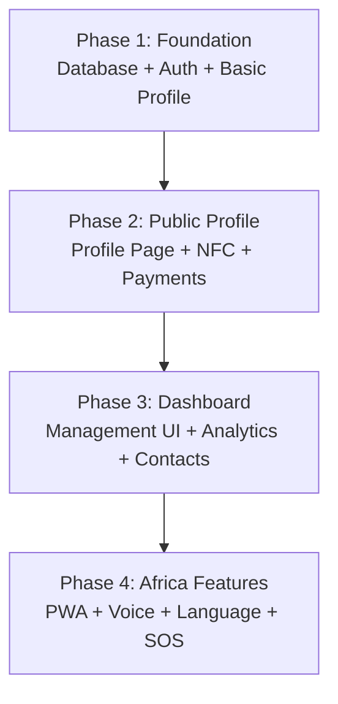

# Link by ReachDem — Implementation Phases & Ticket Breakdown

## Phase Overview

The implementation is broken into 4 phases, each delivering a shippable increment:

## Phase 1 — Foundation (Database, Auth, Scaffolding, Basic Profile CRUD)

### Tickets

| #   | Title                                                  | Scope                                                                                                                                                                                                                                                                                                                                                                                                                                                                                                                                                                                                                             | Depends On |
| --- | ------------------------------------------------------ | --------------------------------------------------------------------------------------------------------------------------------------------------------------------------------------------------------------------------------------------------------------------------------------------------------------------------------------------------------------------------------------------------------------------------------------------------------------------------------------------------------------------------------------------------------------------------------------------------------------------------------- | ---------- |
| 1.1 | **Prisma schema: Link Profile models**                 | Add all new models (`LinkProfile`, `SocialLink`, `PaymentMethod`, `SosInfo`, `NfcBand`, `ScanEvent`, `SocialLinkClick`, `ContactExchange`) and enums (`ProfileType`, `TierType`, `BandStatus`, `ScanSource`, `SocialPlatform`, `PaymentProviderType`) to file:packages/database/prisma/schema.prisma. Include `phone`, `contactEmail`, `qrConfig`, `isActive` on `LinkProfile`. Include `phoneE164` on `PaymentMethod`. Include `organizationId` on `NfcBand`. Include `source` on `ScanEvent`. Add `updatedAt` to all models. Run migration. **Do NOT include \*\***`FamilyMember`\*\* — deferred to Family tier phase.          | —          |
| 1.2 | **Extract R2 utilities to shared package**             | Move file:apps/web/lib/r2.ts (R2 client, `uploadToR2`, `getUploadPresignedUrl`, `deleteFromR2`, validation helpers) to `@reachdem/shared` so both `apps/web` and `apps/links` can reuse them. Update `apps/web` imports.                                                                                                                                                                                                                                                                                                                                                                                                          | —          |
| 1.3 | **Setup \*\***`apps/links`\***\* project scaffolding** | Install shadcn/ui (new-york), Lucide, Motion, Sonner, react-hook-form, Zod, Zustand, recharts. Configure file:apps/links/components.json. Setup `lib/utils.ts` with `cn()`. Add base shadcn components (button, input, card, dialog, sheet, tabs, avatar, badge, skeleton, toast, select, dropdown-menu, separator). Configure PWA manifest (`manifest.json`) and Service Worker registration.                                                                                                                                                                                                                                    | —          |
| 1.4 | **Profile server actions + data queries**              | Implement server actions in `actions/profile.ts` (`createProfile`, `updateProfile`, `deleteProfile`, `switchActiveProfile`), `actions/social-links.ts` (`upsertSocialLinks`, `deleteSocialLink`, `reorderSocialLinks`), `actions/payment-methods.ts` (`upsertPaymentMethod`, `deletePaymentMethod`, `reorderPaymentMethods`). All actions use `requireAuth` from `@reachdem/auth`, Zod validation, and direct Prisma calls. Supports multi-profile for Pro users (max 3). Phone E.164 validation for payment methods. Also create reusable Prisma query functions in `lib/queries/profile.ts` for server component data fetching. | 1.1        |
| 1.5 | **SOS & Band server actions**                          | Implement server actions in `actions/sos.ts` (`upsertSosInfo`), `actions/bands.ts` (`claimBand`, `deactivateBand`, `reactivateBand`). Auth-guarded with Zod validation.                                                                                                                                                                                                                                                                                                                                                                                                                                                           | 1.1        |
| 1.6 | **Public API routes**                                  | Implement the 4 public-facing API routes: `/api/contact-exchange` (POST, rate-limited), `/api/vcard/{profileId}` (GET, returns .vcf file), `/api/scan` (POST, rate-limited), `/api/qr` (GET, returns QR image). These are the only API routes in the app — everything else uses server actions.                                                                                                                                                                                                                                                                                                                                   | 1.1        |
| 1.7 | **Username validation & reservation**                  | Username uniqueness check, format validation (alphanumeric + hyphens, 3-30 chars), profanity filter, reserved words list. Used by `createProfile` and `updateProfile` server actions.                                                                                                                                                                                                                                                                                                                                                                                                                                             | 1.1        |

## Phase 2 — Public Profile Page + NFC + Payments

### Tickets

| #    | Title                                                        | Scope                                                                                                                                                                                                                                                                                                                                                                                                                                                 | Depends On    |
| ---- | ------------------------------------------------------------ | ----------------------------------------------------------------------------------------------------------------------------------------------------------------------------------------------------------------------------------------------------------------------------------------------------------------------------------------------------------------------------------------------------------------------------------------------------- | ------------- |
| 2.1  | **Public profile page (\*\***`/{username}`\***\*)**          | SSR page rendering profile data via direct Prisma query in server component. Mobile-first layout matching wireframe: header/cover, avatar, name, headline, bio, social links grid, payment buttons, location card, contact section, profile QR code, powered-by footer. Responsive for all screen sizes. Apply theme from `themeConfig` via CSS variables.                                                                                            | 1.4           |
| 2.2  | **NFC band redirect (\*\***`/b/{bandCode}`\***\*)**          | Route that looks up `NfcBand` by code, resolves to linked `LinkProfile`, logs a `ScanEvent` with `source: nfc_band`, and redirects (307) to `/{username}`. Handle unassigned/deactivated bands with a friendly error page.                                                                                                                                                                                                                            | 1.5           |
| 2.3  | **Smart band claim route (\*\***`/claim/{bandCode}`\***\*)** | Public auth-aware page: server component checks band status via Prisma query. If already claimed → redirect to linked profile. If unclaimed + logged in → call `claimBand` server action, redirect to dashboard with success toast. If unclaimed + not logged in → redirect to login with return URL, then auto-claim on return.                                                                                                                      | 1.5           |
| 2.4  | **Social link click tracking**                               | When a visitor clicks a social link, log to `SocialLinkClick` model (profileId, socialLinkId, platform, visitorIp, timestamp) via client-side beacon or server action before redirecting.                                                                                                                                                                                                                                                             | 2.1           |
| 2.5  | **Mobile money deeplinks**                                   | Implement payment button click handlers: attempt deeplink to MoMo/Orange/Max It app using `phoneE164`, fallback to web URL or app store after 2s timeout. Display phone number with copy button as secondary action.                                                                                                                                                                                                                                  | 2.1           |
| 2.6  | **Crypto wallet display + QR modal**                         | QR code generation (using a lightweight library like `qrcode`), copy-to-clipboard, modal UI matching wireframe.                                                                                                                                                                                                                                                                                                                                       | 2.1           |
| 2.7  | **Contact exchange: vCard download**                         | Generate `.vcf` file from profile data (`phone`, `contactEmail`, display name, social links). Serve via `/api/vcard/{profileId}`.                                                                                                                                                                                                                                                                                                                     | 2.1           |
| 2.8  | **Contact exchange: visitor form + notifications**           | Bottom sheet / modal form for visitors to share their details. POST to `/api/contact-exchange` public API route (rate-limited: 10/IP/hour). If visitor is a logged-in Link user (`visitorUserId`), auto-fill from their profile. On submission: save to DB, send **email** to profile owner's `contactEmail`, send **SMS** via worker queue (`publishSmsJob`) to profile owner's `phone`. Contact is saved in the app and visible in dashboard inbox. | 2.1, 1.2, 1.6 |
| 2.9  | **Scan event logging**                                       | Log `ScanEvent` on every profile view with `source` field (`nfc_band`, `direct_url`, `qr_code`). Rate-limited (60/IP/min). Detect source from referrer/query params.                                                                                                                                                                                                                                                                                  | 2.2, 1.1      |
| 2.10 | **Profile QR code generation**                               | `/api/qr` endpoint that generates a QR code for a profile URL. Free users: default style with ReachDem logo. Pro users: customizable via `qrConfig` (colors, dot style, corner style, custom logo, no branding). Downloadable as PNG/SVG.                                                                                                                                                                                                             | 1.4           |

## Phase 3 — Dashboard UI + Analytics + Contact Inbox

### Tickets

| #    | Title                                      | Scope                                                                                                                                                                                                                                                                              | Depends On    |
| ---- | ------------------------------------------ | ---------------------------------------------------------------------------------------------------------------------------------------------------------------------------------------------------------------------------------------------------------------------------------- | ------------- |
| 3.1  | **Dashboard layout + navigation**          | App shell with bottom nav (Home, Analytics, Contacts, Settings). Header with user avatar + profile switcher (Pro). Auth-protected layout using `requireAuth`. PWA-optimized (standalone display mode).                                                                             | 1.3           |
| 3.2  | **Onboarding wizard**                      | First-time user flow: welcome screen → choose username → upload avatar → add social links → add payment method → preview → publish. Step-by-step with progress indicator. Shown when user has no `LinkProfile` yet. Uses `createProfile` and related server actions for mutations. | 3.1, 1.4      |
| 3.3  | **Dashboard home / overview**              | Stats cards (total scans, contacts, link clicks), profile preview card with edit button, quick action grid (social links, payments, SOS, theme), recent contacts list. Matching wireframe.                                                                                         | 3.1, 1.4      |
| 3.4  | **Profile editor — single page with tabs** | Single page at `/dashboard/profile` with tab sections: Basic Info, Social Links, Payments, Location, Voice Intro, SOS, Theme. No separate routes for each section.                                                                                                                 | 3.1, 1.4      |
| 3.5  | **Profile editor — basic info tab**        | Form for display name, headline, bio, username, phone, contact email. Avatar upload with crop (using `react-easy-crop` like `apps/web`). Cover image upload. Files uploaded to Cloudflare R2 via shared utilities. Mutations via `updateProfile` server action.                    | 3.4, 1.2      |
| 3.6  | **Profile editor — social links tab**      | Drag-and-drop reorderable list (using `@dnd-kit` like `apps/web`). Add/remove social links. Platform selector dropdown. URL validation per platform. Mutations via `upsertSocialLinks`, `deleteSocialLink`, `reorderSocialLinks` server actions.                                   | 3.4, 1.4      |
| 3.7  | **Profile editor — payment methods tab**   | Add/edit/remove payment methods. Provider selector. Phone number input with E.164 validation for MoMo/Orange/Max It. Wallet address input for crypto. Mutations via `upsertPaymentMethod`, `deletePaymentMethod` server actions.                                                   | 3.4, 1.4      |
| 3.8  | **Profile editor — SOS tab**               | Form for blood type (dropdown), medical conditions, allergies, medications (text areas), insurance info, emergency contacts (dynamic list with name + phone). Mutations via `upsertSosInfo` server action.                                                                         | 3.4, 1.5      |
| 3.9  | **Profile editor — theme tab**             | Cover color picker, accent color, button style (rounded/square), theme presets. Store in `themeConfig` JSON. Live preview.                                                                                                                                                         | 3.4           |
| 3.10 | **Contact exchange inbox**                 | List of received contact exchanges with unread badges (data fetched via Prisma in server component). Detail view showing visitor info + note. Mark as read via `markContactExchangeRead` server action. Export contacts as CSV via `exportContactExchanges` server action.         | 3.1, 2.8      |
| 3.11 | **Analytics page**                         | Scan count over time (line chart using Recharts). Scan source breakdown (NFC vs direct vs QR). Social link click breakdown by platform. Geographic distribution of visitors. Date range filter. All data fetched via Prisma aggregate queries in server components.                | 3.1, 2.4, 2.9 |
| 3.12 | **Settings page**                          | Profile language selector (FR/EN). Publish/unpublish toggle. Share profile link + QR code (with customization for Pro). Profile switcher (Pro — create/switch/delete profiles, max 3). Claimed NFC bands list (view, deactivate, reactivate). Delete profile.                      | 3.1, 2.10     |

## Phase 4 — Africa-Specific Features + Polish

### Tickets

| #   | Title                                      | Scope                                                                                                                                                                                                                                    | Depends On |
| --- | ------------------------------------------ | ---------------------------------------------------------------------------------------------------------------------------------------------------------------------------------------------------------------------------------------- | ---------- |
| 4.1 | **Service Worker + offline caching**       | Implement Service Worker for offline profile caching. Cache profile HTML, CSS, images, voice audio on first visit. Offline fallback page. Cache invalidation strategy (stale-while-revalidate).                                          | 2.1, 1.3   |
| 4.2 | **Language toggle on public profile**      | FR/EN toggle button on profile page. Static i18n dictionary for system strings (section titles, button labels, disclaimers). Persist visitor's choice in localStorage.                                                                   | 2.1        |
| 4.3 | **Voice introduction — browser recording** | In-dashboard audio recorder using MediaRecorder API. Waveform visualization. 30-second max. Upload to Cloudflare R2 via shared utilities. Preview and delete.                                                                            | 3.5, 1.2   |
| 4.4 | **Voice introduction — AI generation**     | Language selector (FR, EN, Pidgin, local languages). Text input or auto-generate from profile. Call AI TTS API. Preview before saving. Upload to R2.                                                                                     | 4.3        |
| 4.5 | **what3words location integration**        | Input field in profile editor for what3words address. Display on public profile with link to what3words map. Optional: reverse geocode from what3words to display human-readable address.                                                | 3.5, 2.1   |
| 4.6 | **SOS section on public profile**          | Expandable red "Urgence / SOS" button at bottom of profile. Disclaimer text with "These details are for first responders in emergencies." Display blood type, conditions, allergies, medications, emergency contacts with click-to-call. | 2.1, 1.5   |
| 4.7 | **QR code customization UI (Pro)**         | Dashboard UI for Pro users to customize their profile QR code: color picker, dot style selector, corner style, upload custom logo, toggle ReachDem branding. Live preview. Save to `qrConfig`.                                           | 3.12, 2.10 |

## Estimated Effort

| Phase     | Tickets        | Estimated Duration |
| --------- | -------------- | ------------------ |
| Phase 1   | 7 tickets      | ~1.5 weeks         |
| Phase 2   | 10 tickets     | ~2.5 weeks         |
| Phase 3   | 12 tickets     | ~2.5 weeks         |
| Phase 4   | 7 tickets      | ~1.5 weeks         |
| **Total** | **36 tickets** | **~8 weeks**       |

## Future Phases (not in MVP)

- **Business Tier** — Admin dashboard, fleet management, brand enforcement, central inbox, announcements
- **Family Tier** — Parent dashboard, child profiles, GPS share button, SMS-on-scan notifications
- **WhatsApp Notifications** — Replace SMS with WhatsApp Business API for scan alerts
- **Custom Domains** — Allow users to use their own domain for profiles
- **Analytics v2** — Heatmaps, conversion funnels, A/B testing for profile layouts
