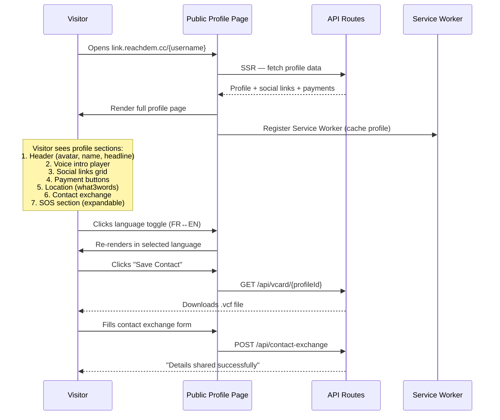

# Link by ReachDem — Public Profile Page (Individual Pro)

## Overview

The public profile page is the core user-facing product. When anyone taps an NFC band or visits `link.reachdem.cc/{username}`, they see a mobile-first profile page with the owner's identity, social links, payment buttons, contact exchange, and optional SOS section. No app install required — it's a responsive web page.

## Profile Page Flow



## Wireframes

### Mobile Profile Page — Main View

```wireframe

<html>
<head>
<style>
  * { margin: 0; padding: 0; box-sizing: border-box; }
  body { font-family: -apple-system, BlinkMacSystemFont, 'Segoe UI', sans-serif; background: #f8f9fa; min-height: 100vh; }
  .profile-container { max-width: 430px; margin: 0 auto; background: #fff; min-height: 100vh; position: relative; }
  .cover { height: 140px; background: linear-gradient(135deg, #1a1a2e 0%, #16213e 100%); position: relative; }
  .lang-toggle { position: absolute; top: 12px; right: 12px; background: rgba(255,255,255,0.2); border: 1px solid rgba(255,255,255,0.3); border-radius: 20px; padding: 4px 12px; color: #fff; font-size: 12px; cursor: pointer; backdrop-filter: blur(4px); }
  .lang-toggle span.active { font-weight: 700; }
  .avatar-section { display: flex; flex-direction: column; align-items: center; margin-top: -50px; position: relative; z-index: 2; padding: 0 24px; }
  .avatar { width: 100px; height: 100px; border-radius: 50%; border: 4px solid #fff; background: #e0e0e0; display: flex; align-items: center; justify-content: center; font-size: 36px; box-shadow: 0 2px 12px rgba(0,0,0,0.15); }
  .name { font-size: 22px; font-weight: 700; color: #1a1a2e; margin-top: 12px; }
  .headline { font-size: 14px; color: #666; margin-top: 4px; text-align: center; }
  .bio { font-size: 13px; color: #888; margin-top: 8px; text-align: center; line-height: 1.5; padding: 0 12px; }
  .voice-btn { display: flex; align-items: center; gap: 8px; margin-top: 12px; padding: 8px 16px; background: #f0f0f5; border-radius: 20px; border: none; font-size: 13px; color: #1a1a2e; cursor: pointer; }
  .voice-btn .icon { width: 20px; height: 20px; background: #1a1a2e; border-radius: 50%; display: flex; align-items: center; justify-content: center; color: #fff; font-size: 10px; }
  .section { padding: 20px 24px; }
  .section-title { font-size: 11px; font-weight: 600; color: #999; text-transform: uppercase; letter-spacing: 1px; margin-bottom: 12px; }
  .social-grid { display: grid; grid-template-columns: 1fr 1fr; gap: 10px; }
  .social-btn { display: flex; align-items: center; gap: 10px; padding: 12px 14px; border-radius: 12px; border: 1px solid #e8e8e8; background: #fff; cursor: pointer; transition: all 0.2s; }
  .social-btn:hover { border-color: #1a1a2e; }
  .social-icon { width: 32px; height: 32px; border-radius: 8px; display: flex; align-items: center; justify-content: center; font-size: 14px; color: #fff; }
  .social-icon.wa { background: #25D366; }
  .social-icon.tt { background: #000; }
  .social-icon.ig { background: linear-gradient(45deg, #f09433, #e6683c, #dc2743, #cc2366, #bc1888); }
  .social-icon.li { background: #0077B5; }
  .social-icon.fb { background: #1877F2; }
  .social-icon.tg { background: #0088cc; }
  .social-label { font-size: 13px; font-weight: 500; color: #333; }
  .payment-list { display: flex; flex-direction: column; gap: 10px; }
  .payment-btn { display: flex; align-items: center; gap: 12px; padding: 14px 16px; border-radius: 12px; border: 1px solid #e8e8e8; background: #fff; cursor: pointer; }
  .payment-icon { width: 36px; height: 36px; border-radius: 8px; display: flex; align-items: center; justify-content: center; font-size: 12px; font-weight: 700; color: #fff; }
  .payment-icon.momo { background: #FFCB05; color: #000; }
  .payment-icon.orange { background: #FF6600; }
  .payment-icon.maxit { background: #003DA5; }
  .payment-icon.usdt { background: #26A17B; }
  .payment-info { flex: 1; }
  .payment-name { font-size: 13px; font-weight: 600; color: #333; }
  .payment-detail { font-size: 11px; color: #999; margin-top: 2px; }
  .payment-action { font-size: 11px; color: #1a1a2e; font-weight: 600; }
  .location-card { display: flex; align-items: center; gap: 12px; padding: 14px 16px; border-radius: 12px; background: #f8f9fa; }
  .location-icon { font-size: 20px; }
  .location-text { font-size: 13px; color: #333; }
  .location-w3w { font-size: 11px; color: #E11F26; margin-top: 2px; }
  .contact-section { background: #f8f9fa; border-radius: 16px; padding: 20px; margin: 0 24px 20px; }
  .save-btn { width: 100%; padding: 14px; border-radius: 12px; background: #1a1a2e; color: #fff; font-size: 14px; font-weight: 600; border: none; cursor: pointer; margin-bottom: 10px; }
  .share-btn { width: 100%; padding: 14px; border-radius: 12px; background: #fff; color: #1a1a2e; font-size: 14px; font-weight: 600; border: 1px solid #1a1a2e; cursor: pointer; }
  .sos-section { margin: 0 24px 40px; }
  .sos-trigger { width: 100%; padding: 14px; border-radius: 12px; background: #fff; border: 2px solid #DC2626; color: #DC2626; font-size: 14px; font-weight: 600; cursor: pointer; display: flex; align-items: center; justify-content: center; gap: 8px; }
  .sos-expanded { margin-top: 12px; padding: 16px; background: #FEF2F2; border-radius: 12px; border: 1px solid #FECACA; }
  .sos-disclaimer { font-size: 11px; color: #DC2626; margin-bottom: 12px; font-style: italic; }
  .sos-row { display: flex; justify-content: space-between; padding: 8px 0; border-bottom: 1px solid #FECACA; }
  .sos-label { font-size: 12px; color: #991B1B; font-weight: 600; }
  .sos-value { font-size: 12px; color: #333; }
  .sos-contacts { margin-top: 12px; }
  .sos-contact { display: flex; align-items: center; gap: 8px; padding: 8px 0; }
  .sos-contact-name { font-size: 12px; font-weight: 600; color: #333; }
  .sos-contact-phone { font-size: 12px; color: #DC2626; }
  .powered-by { text-align: center; padding: 20px; font-size: 11px; color: #ccc; }
</style>
</head>
<body>
  <div class="profile-container">
    <div class="cover">
      <button class="lang-toggle" data-element-id="lang-toggle"><span class="active">FR</span> | <span>EN</span></button>
    </div>

    <div class="avatar-section">
      <div class="avatar">👤</div>
      <div class="name">Jean-Pierre Kamga</div>
      <div class="headline">Développeur Full-Stack · Douala 🇨🇲</div>
      <div class="bio">Building digital solutions for African businesses. Available for freelance projects and consulting.</div>
      <button class="voice-btn" data-element-id="voice-intro-btn">
        <span class="icon">▶</span>
        Écouter mon intro · Français
      </button>
    </div>

    <div class="section">
      <div class="section-title">Réseaux sociaux</div>
      <div class="social-grid">
        <div class="social-btn" data-element-id="social-whatsapp">
          <div class="social-icon wa">W</div>
          <span class="social-label">WhatsApp</span>
        </div>
        <div class="social-btn" data-element-id="social-tiktok">
          <div class="social-icon tt">T</div>
          <span class="social-label">TikTok</span>
        </div>
        <div class="social-btn" data-element-id="social-instagram">
          <div class="social-icon ig">I</div>
          <span class="social-label">Instagram</span>
        </div>
        <div class="social-btn" data-element-id="social-linkedin">
          <div class="social-icon li">in</div>
          <span class="social-label">LinkedIn</span>
        </div>
        <div class="social-btn" data-element-id="social-facebook">
          <div class="social-icon fb">f</div>
          <span class="social-label">Facebook</span>
        </div>
        <div class="social-btn" data-element-id="social-telegram">
          <div class="social-icon tg">✈</div>
          <span class="social-label">Telegram</span>
        </div>
      </div>
    </div>

    <div class="section">
      <div class="section-title">Paiements</div>
      <div class="payment-list">
        <div class="payment-btn" data-element-id="pay-momo">
          <div class="payment-icon momo">MTN</div>
          <div class="payment-info">
            <div class="payment-name">MTN MoMo</div>
            <div class="payment-detail">6 XX XXX XX XX</div>
          </div>
          <div class="payment-action">Payer →</div>
        </div>
        <div class="payment-btn" data-element-id="pay-orange">
          <div class="payment-icon orange">OM</div>
          <div class="payment-info">
            <div class="payment-name">Orange Money</div>
            <div class="payment-detail">6 XX XXX XX XX</div>
          </div>
          <div class="payment-action">Payer →</div>
        </div>
        <div class="payment-btn" data-element-id="pay-maxit">
          <div class="payment-icon maxit">MAX</div>
          <div class="payment-info">
            <div class="payment-name">Max It</div>
            <div class="payment-detail">6 XX XXX XX XX</div>
          </div>
          <div class="payment-action">Ouvrir →</div>
        </div>
        <div class="payment-btn" data-element-id="pay-usdt">
          <div class="payment-icon usdt">₮</div>
          <div class="payment-info">
            <div class="payment-name">USDT (TRC-20)</div>
            <div class="payment-detail">TXxx...xxxx</div>
          </div>
          <div class="payment-action">Copier / QR</div>
        </div>
      </div>
    </div>

    <div class="section">
      <div class="section-title">Localisation</div>
      <div class="location-card" data-element-id="location">
        <span class="location-icon">📍</span>
        <div>
          <div class="location-text">Akwa, Douala, Cameroun</div>
          <div class="location-w3w">///table.lamp.spoon</div>
        </div>
      </div>
    </div>

    <div class="contact-section">
      <button class="save-btn" data-element-id="save-contact">📇 Enregistrer le contact</button>
      <button class="share-btn" data-element-id="share-details">🤝 Partager mes coordonnées</button>
    </div>

    <div class="sos-section">
      <button class="sos-trigger" data-element-id="sos-trigger">🚨 Urgence / SOS</button>
      <div class="sos-expanded">
        <div class="sos-disclaimer">⚠️ Ces informations sont destinées aux premiers secours en cas d'urgence.</div>
        <div class="sos-row">
          <span class="sos-label">Groupe sanguin</span>
          <span class="sos-value">O+</span>
        </div>
        <div class="sos-row">
          <span class="sos-label">Allergies</span>
          <span class="sos-value">Pénicilline</span>
        </div>
        <div class="sos-row">
          <span class="sos-label">Conditions</span>
          <span class="sos-value">Asthme</span>
        </div>
        <div class="sos-row">
          <span class="sos-label">Médicaments</span>
          <span class="sos-value">Ventoline</span>
        </div>
        <div class="sos-contacts">
          <div class="section-title" style="margin-top:8px;">Contacts d'urgence</div>
          <div class="sos-contact">
            <span class="sos-contact-name">Marie Kamga (Mère)</span>
            <span class="sos-contact-phone">+237 6XX XXX XXX</span>
          </div>
          <div class="sos-contact">
            <span class="sos-contact-name">Dr. Nkeng</span>
            <span class="sos-contact-phone">+237 6XX XXX XXX</span>
          </div>
        </div>
      </div>
    </div>

    <div class="powered-by">Powered by Link · ReachDem</div>
  </div>
</body>
</html>
```

### Contact Exchange Form (Modal)

```wireframe

<html>
<head>
<style>
  * { margin: 0; padding: 0; box-sizing: border-box; }
  body { font-family: -apple-system, BlinkMacSystemFont, 'Segoe UI', sans-serif; background: rgba(0,0,0,0.5); min-height: 100vh; display: flex; align-items: flex-end; justify-content: center; }
  .modal { width: 100%; max-width: 430px; background: #fff; border-radius: 20px 20px 0 0; padding: 24px; }
  .handle { width: 40px; height: 4px; background: #ddd; border-radius: 2px; margin: 0 auto 20px; }
  .modal-title { font-size: 18px; font-weight: 700; color: #1a1a2e; margin-bottom: 4px; }
  .modal-desc { font-size: 13px; color: #888; margin-bottom: 20px; }
  .form-group { margin-bottom: 16px; }
  .form-label { font-size: 12px; font-weight: 600; color: #555; margin-bottom: 6px; display: block; }
  .form-input { width: 100%; padding: 12px 14px; border: 1px solid #e0e0e0; border-radius: 10px; font-size: 14px; outline: none; }
  .form-input:focus { border-color: #1a1a2e; }
  .form-textarea { width: 100%; padding: 12px 14px; border: 1px solid #e0e0e0; border-radius: 10px; font-size: 14px; outline: none; min-height: 80px; resize: none; }
  .submit-btn { width: 100%; padding: 14px; border-radius: 12px; background: #1a1a2e; color: #fff; font-size: 14px; font-weight: 600; border: none; cursor: pointer; margin-top: 8px; }
  .cancel-btn { width: 100%; padding: 14px; border-radius: 12px; background: transparent; color: #888; font-size: 14px; border: none; cursor: pointer; margin-top: 4px; }
</style>
</head>
<body>
  <div class="modal">
    <div class="handle"></div>
    <div class="modal-title">Partager mes coordonnées</div>
    <div class="modal-desc">Jean-Pierre recevra vos informations de contact.</div>

    <div class="form-group">
      <label class="form-label">Nom complet *</label>
      <input class="form-input" type="text" placeholder="Votre nom" data-element-id="exchange-name" />
    </div>
    <div class="form-group">
      <label class="form-label">Téléphone *</label>
      <input class="form-input" type="tel" placeholder="+237 6XX XXX XXX" data-element-id="exchange-phone" />
    </div>
    <div class="form-group">
      <label class="form-label">Email</label>
      <input class="form-input" type="email" placeholder="votre@email.com" data-element-id="exchange-email" />
    </div>
    <div class="form-group">
      <label class="form-label">Note (optionnel)</label>
      <textarea class="form-textarea" placeholder="Un message pour Jean-Pierre..." data-element-id="exchange-note"></textarea>
    </div>

    <button class="submit-btn" data-element-id="exchange-submit">Envoyer mes coordonnées</button>
    <button class="cancel-btn" data-element-id="exchange-cancel">Annuler</button>
  </div>
</body>
</html>
```

### Crypto QR Code Modal

```wireframe

<html>
<head>
<style>
  * { margin: 0; padding: 0; box-sizing: border-box; }
  body { font-family: -apple-system, BlinkMacSystemFont, 'Segoe UI', sans-serif; background: rgba(0,0,0,0.5); min-height: 100vh; display: flex; align-items: center; justify-content: center; }
  .modal { width: 340px; background: #fff; border-radius: 20px; padding: 28px; text-align: center; }
  .crypto-icon { width: 48px; height: 48px; background: #26A17B; border-radius: 12px; display: flex; align-items: center; justify-content: center; color: #fff; font-size: 20px; font-weight: 700; margin: 0 auto 16px; }
  .crypto-title { font-size: 16px; font-weight: 700; color: #1a1a2e; }
  .crypto-network { font-size: 12px; color: #888; margin-top: 4px; }
  .qr-placeholder { width: 180px; height: 180px; background: #f0f0f0; border-radius: 12px; margin: 20px auto; display: flex; align-items: center; justify-content: center; font-size: 12px; color: #999; border: 2px dashed #ddd; }
  .address-box { background: #f8f9fa; border-radius: 10px; padding: 12px; margin-top: 16px; }
  .address-text { font-size: 11px; color: #333; word-break: break-all; font-family: monospace; }
  .copy-btn { width: 100%; padding: 12px; border-radius: 10px; background: #1a1a2e; color: #fff; font-size: 13px; font-weight: 600; border: none; cursor: pointer; margin-top: 12px; }
  .close-btn { width: 100%; padding: 12px; background: transparent; color: #888; font-size: 13px; border: none; cursor: pointer; margin-top: 4px; }
</style>
</head>
<body>
  <div class="modal">
    <div class="crypto-icon">₮</div>
    <div class="crypto-title">USDT</div>
    <div class="crypto-network">Réseau TRC-20 (Tron)</div>
    <div class="qr-placeholder" data-element-id="qr-code">[QR Code]</div>
    <div class="address-box">
      <div class="address-text" data-element-id="wallet-address">TXa1b2c3d4e5f6g7h8i9j0k1l2m3n4o5p6</div>
    </div>
    <button class="copy-btn" data-element-id="copy-address">📋 Copier l'adresse</button>
    <button class="close-btn" data-element-id="close-modal">Fermer</button>
  </div>
</body>
</html>
```

## Mobile Money Deeplinks

Payment buttons use deeplinks to open the MoMo / Orange Money / Max It apps directly on the visitor's phone:

| Provider     | Deeplink Pattern                                                                   |
| ------------ | ---------------------------------------------------------------------------------- |
| MTN MoMo     | `momo://transfer?recipient={phone}` with fallback to `https://momo.mtn.cm`         |
| Orange Money | `orangemoney://transfer?recipient={phone}` with fallback to Play Store / App Store |
| Max It       | `maxit://pay?to={phone}` with fallback to `https://www.maxit.cm`                   |

The implementation should attempt the deeplink first, then fall back to the web URL or app store link after a short timeout (~2 seconds).

## Language Toggle

- Profile owner writes content in one language (FR or EN, stored in `LinkProfile.language`)
- The public page shows a **FR | EN** toggle in the top-right corner
- Toggling switches the UI chrome (section titles, button labels, disclaimers) to the selected language using a static i18n dictionary
- The profile owner's custom content (bio, headline, labels) stays in the original language — only system strings switch
- Default language on first visit: the owner's chosen language

## Offline / PWA

- The entire `apps/links` app is a **PWA** — both public profiles and the dashboard
- Register a Service Worker on first profile visit
- Cache the profile HTML, CSS, avatar image, and voice intro audio
- On subsequent visits with no connectivity, serve from cache
- Add a `manifest.json` with app name ("Link by ReachDem"), icons, theme color, `display: standalone`
- "Add to Home Screen" capability for both visitors and profile owners
- Target: profile loads in < 2 seconds on 3G

## Profile QR Code

- Every public profile displays a shareable QR code section
- Visitors can scan the QR to share the profile with others
- QR code appearance depends on the profile owner's tier:
  - **Free**: default style with ReachDem logo
  - **Pro**: customized colors, dot style, optional custom logo, no ReachDem branding
- QR code is generated server-side via `/api/qr` and cached
