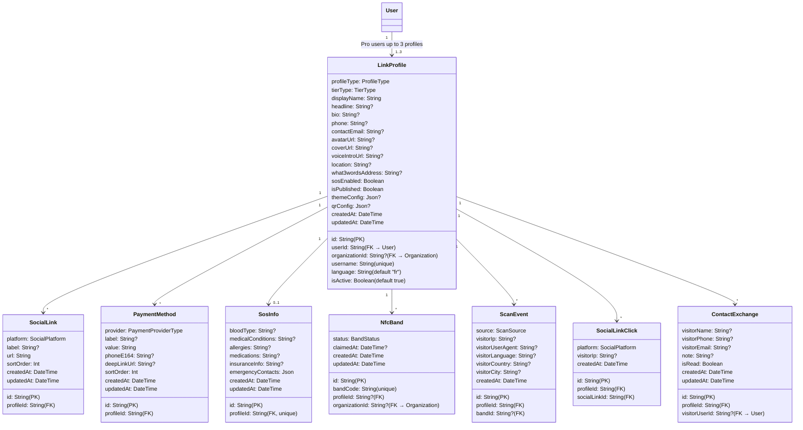

# Link by ReachDem — Technical Architecture & Data Model

## Overview

Link by ReachDem is an NFC-powered digital identity platform built inside file:apps/links — a Next.js 16 app that shares the same database (`@reachdem/database`) and auth system (`@reachdem/auth`) as the main ReachDem platform. It has its own lightweight dashboard for profile management and serves public-facing profile pages at `link.reachdem.cc/{username}`.

## Finalized Product Decisions

| #   | Decision               | Choice                                                                                                  |
| --- | ---------------------- | ------------------------------------------------------------------------------------------------------- |
| 1   | Architecture           | Own lightweight dashboard in `apps/links`, shared auth/org/database                                     |
| 2   | URL Structure          | `link.reachdem.cc/{username}` (subdomain)                                                               |
| 3   | Tier Priority          | Individual Pro first → Business → Family                                                                |
| 4   | NFC Provisioning       | Pre-programmed with unique ID, user claims via code in dashboard                                        |
| 5   | Mobile Money           | Deeplink through MoMo and Max It apps                                                                   |
| 6   | Crypto Wallets         | Wallet address with copy button + QR code                                                               |
| 7   | Contact Exchange       | Form for visitors without account; instant exchange for users with account                              |
| 8   | GPS Share              | Open native maps, share location via WhatsApp to parent                                                 |
| 9   | Bilingual              | Owner writes one language, visitor gets a toggle to switch                                              |
| 10  | Offline                | Service Worker + PWA (cache on first visit)                                                             |
| 11  | Voice Intro            | Record in browser/app or generate using AI                                                              |
| 12  | SOS Access             | Visible with disclaimer, no PIN (fast emergency access)                                                 |
| 13  | UI Library             | Same as `apps/web`: shadcn/ui (new-york), Radix, Lucide, Motion, Sonner, Zustand, react-hook-form + Zod |
| 14  | WhatsApp Notifications | Start with SMS, add WhatsApp later                                                                      |

## System Architecture

```mermaid
sequenceDiagram
    participant Visitor as Visitor Phone
    participant NFC as NFC Band/Card
    participant Links as apps/links (Next.js)
    participant DB as PostgreSQL (shared)
    participant Auth as @reachdem/auth
    participant Worker as SMS Worker (Cloudflare)
    participant R2 as Cloudflare R2 Storage

    Note over NFC: Pre-programmed URL:<br/>link.reachdem.cc/b/{bandCode}

    Visitor->>NFC: Taps NFC band
    NFC->>Links: Opens link.reachdem.cc/b/{bandCode}
    Links->>DB: Lookup NfcBand → LinkProfile
    Links->>DB: Log ScanEvent (IP, UA, geo, timestamp, source=nfc_band)
    Links-->>Worker: Publish SMS job (Family tier notification)
    Links->>Visitor: Render public profile page (SSR)

    Note over Visitor: Profile shows:<br/>- Social links<br/>- Payment buttons<br/>- Contact exchange<br/>- SOS section<br/>- Profile QR code

    Visitor->>Links: Clicks "Save Contact"
    Links->>Visitor: Downloads vCard (.vcf)

    Visitor->>Links: Submits contact exchange form
    Links->>DB: Store ContactExchange record
    Links-->>Worker: Publish SMS job (notify profile owner)
    Links->>Links: Send email notification to profile owner
```

## Data Model — New Prisma Models

All new models are added to the shared file:packages/database/prisma/schema.prisma. They coexist with the existing ReachDem models.

### Entity Relationship Diagram



### Enums

```
enum ProfileType { individual, business, child }
enum TierType { free, pro, business, family }
enum BandStatus { unassigned, active, lost, deactivated }
enum ScanSource { nfc_band, direct_url, qr_code }
enum SocialPlatform { whatsapp, tiktok, instagram, linkedin, facebook, twitter, youtube, telegram, snapchat, website, custom }
enum PaymentProviderType { mtn_momo, orange_money, max_it, usdt_trc20, usdc, custom }
```

### Key Design Decisions

- **`LinkProfile.userId`** links to the existing `User` model from Better Auth — no separate user system
- **`LinkProfile.organizationId`** is optional — Individual Pro profiles don't need an org; Business profiles are org-scoped
- **`LinkProfile.username`** is globally unique and forms the public URL: `link.reachdem.cc/{username}`
- **`LinkProfile.phone`** and **`LinkProfile.contactEmail`** are used for vCard generation and contact exchange notifications (separate from the User model's email)
- **`LinkProfile.qrConfig`** stores QR code customization: style, colors, logo removal (Pro only). Free users get a default QR with ReachDem branding
- **Multi-profile support**: Pro users can create up to 3 profiles and switch between them. Free users get 1 profile. The `isActive` flag determines which profile is currently linked to their NFC band
- **`NfcBand.bandCode`** is the unique code pre-programmed into the physical band; the URL `link.reachdem.cc/b/{bandCode}` redirects to the linked profile
- **`NfcBand.organizationId`** is included for future Business tier fleet management
- **`PaymentMethod.phoneE164`** stores the phone number in E.164 format for MoMo/Orange Money deeplink generation, separate from the display `value`
- **`ScanEvent.source`** distinguishes between NFC band taps, direct URL visits, and QR code scans for analytics
- **`SocialLinkClick`** is a dedicated model for tracking social link clicks, separate from `ScanEvent` (profile views)
- **`ContactExchange.visitorUserId`** is set when the visitor is a logged-in Link user (instant exchange); otherwise the form fields are used
- **Contact exchange notifications**: both email and SMS are sent to the profile owner when a visitor shares their details
- **`FamilyMember`** model is deferred to the Family tier phase (not in MVP schema)

## Route Architecture

### Public Routes (no auth required)

| Route                    | Purpose                                 |
| ------------------------ | --------------------------------------- |
| `/{username}`            | Public profile page (SSR)               |
| `/b/{bandCode}`          | NFC band redirect → resolves to profile |
| `/api/contact-exchange`  | POST — submit contact exchange form     |
| `/api/vcard/{profileId}` | GET — download vCard                    |
| `/api/scan`              | POST — log scan event                   |

### Dashboard Routes (auth required)

| Route                  | Purpose                                                                                                               |
| ---------------------- | --------------------------------------------------------------------------------------------------------------------- |
| `/dashboard`           | Profile overview + analytics                                                                                          |
| `/dashboard/profile`   | Edit profile (all sections: basic info, social links, payments, SOS, voice, theme — as tabs/sections within one page) |
| `/dashboard/contacts`  | View contact exchanges (inbox)                                                                                        |
| `/dashboard/analytics` | Scan analytics + link clicks                                                                                          |
| `/dashboard/settings`  | Account settings, language, theme, QR code customization, profile switcher (Pro)                                      |

### Band Claim Route (public, auth-aware)

| Route               | Purpose                                                                                                                                                                                                                                        |
| ------------------- | ---------------------------------------------------------------------------------------------------------------------------------------------------------------------------------------------------------------------------------------------- |
| `/claim/{bandCode}` | Smart band claim page: if band is already claimed → redirect to the linked profile. If unclaimed + user is logged in → auto-claim and assign to user's active profile. If unclaimed + not logged in → redirect to login, then claim on return. |

### API Routes (public endpoints only)

API routes are reserved for **public-facing endpoints** that are called by unauthenticated visitors or return non-JSON responses:

| Route                    | Purpose                                                    |
| ------------------------ | ---------------------------------------------------------- |
| `/api/auth/[...all]`     | Better Auth handler (existing)                             |
| `/api/contact-exchange`  | POST — submit contact exchange form (rate-limited, public) |
| `/api/vcard/{profileId}` | GET — download vCard file (public)                         |
| `/api/scan`              | POST — log scan event (rate-limited, public)               |
| `/api/qr`                | GET — generate profile QR code image (public)              |

### Server Actions (dashboard mutations)

All dashboard mutations use **Next.js Server Actions** (`"use server"` functions in `apps/links/actions/`), following the same pattern as file:apps/web/actions/contacts.ts. Server actions call Prisma directly, are type-safe, and are automatically protected by auth guards.

| Action File                  | Functions                                                                |
| ---------------------------- | ------------------------------------------------------------------------ |
| `actions/profile.ts`         | `createProfile`, `updateProfile`, `deleteProfile`, `switchActiveProfile` |
| `actions/social-links.ts`    | `upsertSocialLinks`, `deleteSocialLink`, `reorderSocialLinks`            |
| `actions/payment-methods.ts` | `upsertPaymentMethod`, `deletePaymentMethod`, `reorderPaymentMethods`    |
| `actions/sos.ts`             | `upsertSosInfo`                                                          |
| `actions/bands.ts`           | `claimBand`, `deactivateBand`, `reactivateBand`                          |
| `actions/voice-intro.ts`     | `saveVoiceIntro`, `deleteVoiceIntro`, `generateAiVoiceIntro`             |
| `actions/contacts.ts`        | `markContactExchangeRead`, `exportContactExchanges`                      |
| `actions/settings.ts`        | `updateProfileSettings`, `updateQrConfig`                                |

### Data Fetching (reads)

All data fetching uses **direct Prisma queries in Server Components** — no API routes needed for reads:

| Page                           | Data Source                                                                   |
| ------------------------------ | ----------------------------------------------------------------------------- |
| `/{username}` (public profile) | Server Component → Prisma query for `LinkProfile` + relations                 |
| `/b/{bandCode}` (NFC redirect) | Server Component → Prisma query for `NfcBand` → redirect                      |
| `/claim/{bandCode}`            | Server Component → Prisma query for `NfcBand` status                          |
| `/dashboard` (overview)        | Server Component → Prisma aggregates (scan count, contact count, click count) |
| `/dashboard/profile`           | Server Component → Prisma query for `LinkProfile` + all relations             |
| `/dashboard/contacts`          | Server Component → Prisma query for `ContactExchange` (paginated)             |
| `/dashboard/analytics`         | Server Component → Prisma aggregates + time-series queries                    |
| `/dashboard/settings`          | Server Component → Prisma query for `LinkProfile` + `NfcBand` list            |

## Tech Stack (aligned with `apps/web`)

| Layer        | Technology                                                                                                  |
| ------------ | ----------------------------------------------------------------------------------------------------------- |
| Framework    | Next.js 16 (App Router, RSC)                                                                                |
| Styling      | Tailwind CSS 4                                                                                              |
| Components   | shadcn/ui (new-york style), Radix UI primitives                                                             |
| Icons        | Lucide React                                                                                                |
| Animations   | Motion (Framer Motion)                                                                                      |
| Toasts       | Sonner                                                                                                      |
| Forms        | react-hook-form + Zod                                                                                       |
| State        | Zustand                                                                                                     |
| Auth         | `@reachdem/auth` (Better Auth, cross-subdomain cookies)                                                     |
| Database     | `@reachdem/database` (Prisma + PostgreSQL)                                                                  |
| File Storage | Cloudflare R2 (avatars, voice intros) — reuse existing file:apps/web/lib/r2.ts utilities via shared package |
| Offline      | Service Worker + PWA manifest                                                                               |

## Cross-Subdomain Auth

The existing auth config in file:packages/auth/src/auth.ts already supports cross-subdomain cookies via `crossSubDomainCookies` on `.reachdem.cc`. The `trustedOrigins` array includes `NEXT_PUBLIC_LINKS_URL`. This means:

- A user logged into `app.reachdem.cc` is automatically authenticated on `link.reachdem.cc`
- The dashboard at `link.reachdem.cc/dashboard` uses the same session
- No separate login flow needed

## Deployment

- `apps/links` deploys to `link.reachdem.cc` (separate Vercel project or subdomain routing)
- Shares the same PostgreSQL database as `apps/web`
- The entire `apps/links` app is a **PWA** — both the dashboard and public profile pages support "Add to Home Screen" and offline caching via Service Worker
- Environment variables: `BETTER_AUTH_URL`, `NEXT_PUBLIC_LINKS_URL`, `DATABASE_URL`, `R2_ACCOUNT_ID`, `R2_ACCESS_KEY_ID`, `R2_SECRET_ACCESS_KEY`, `R2_BUCKET_NAME`, `R2_PUBLIC_URL`, `SMS_WORKER_BASE_URL`

## Rate Limiting

Public API endpoints (`/api/contact-exchange`, `/api/scan`) must be rate-limited to prevent spam/abuse:

- IP-based rate limiting (e.g., 10 contact exchanges per IP per hour, 60 scan logs per IP per minute)
- Consider using `@upstash/ratelimit` or a similar lightweight solution
