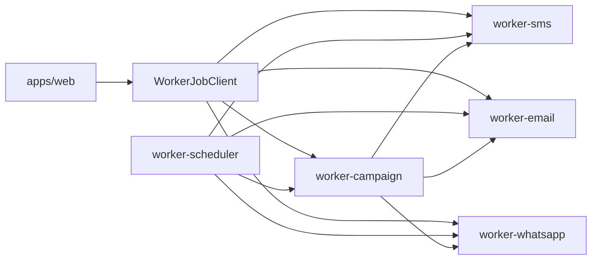

# Architecture des workers ReachDem

ReachDem utilise des workers Cloudflare séparés par responsabilité. Le design produit reste inchangé : le web crée des messages/campagnes, puis les workers exécutent le travail asynchrone.

## Flux global

## Responsabilités

- `packages/jobs` porte les contrats de jobs, les schemas Zod et les noms de queues par environnement.
- `packages/worker-kit` porte les primitives communes : env strictes, auth interne, logs, erreurs, `sendBatch`, ack/retry.
- `worker-campaign` transforme une campagne en jobs par canal.
- `worker-email`, `worker-sms`, `worker-whatsapp` livrent les messages via les providers.
- `worker-scheduler` claim les campagnes/messages planifiés et publie vers les queues.
- `worker-pdf` est réservé comme extension future et n’a pas de runtime v1.

## Règles

- Aucun worker ne doit lire les env vars d’un autre domaine.
- Aucun appel web ne doit viser l’ancien `apps/workers`.
- Tout endpoint `/queue/*` est protégé par `x-internal-secret`.
- `/health` reste public et ne retourne jamais de secret.
- Les noms de queues viennent du registre `@reachdem/jobs`, pas de strings dispersées.
- En production, les nouveaux workers utilisent des queues `v2-production` pour éviter le conflit avec l'ancien monolithe tant qu'il existe encore.
